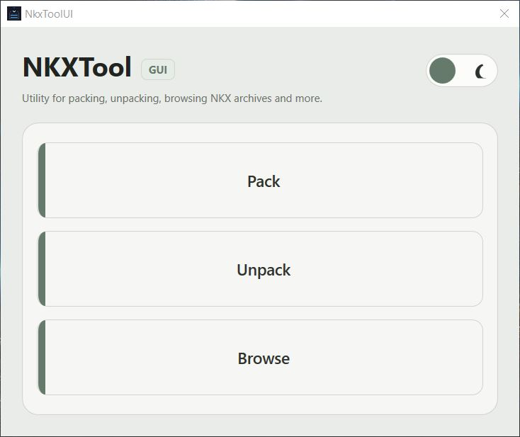
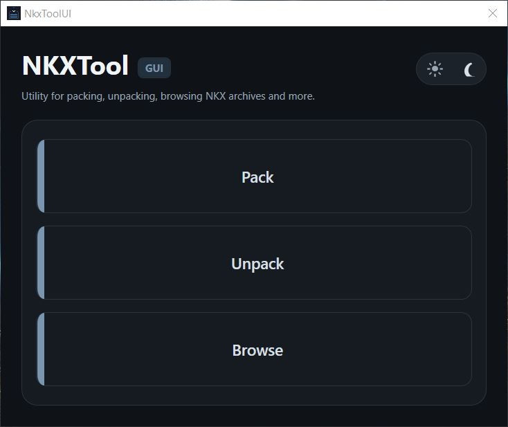

# NKXTool-UI

A lightweight desktop interface for `NkxTool.exe` to browse, create, and extract NKX and other NI archives format on Windows.

The application focuses on a clean native workflow: pack a folder, pack from a `@filelist.txt`, unpack one or more archives, browse archive contents, switch light/dark theme, and run batch multi-pack operations from a single window.

### Light Theme


### Dark Theme


## Features

- Pack a whole folder into an `.nkx` archive.
- Pack from a `@filelist.txt` with an optional root path.
- Multi-pack mode: select multiple source folders and create one archive per folder.
- Optional multi-pack behavior to include the parent folder or archive only its contents.
- Unpack one or more archives to a target folder.
- Browse archive contents before extraction.
- Live console/log output in the UI.
- Light and dark theme support.
- Configurable path to `NkxTool.exe` through `nkxtoolsettings.json`.

## Requirements

- Windows
- .NET desktop runtime / SDK version 10.0
- `NkxTool.exe` available either:
  - next to the application executable, or
  - in a path configured through `nkxtoolsettings.json`

## Getting started

### 1. Clone the repository

```bash
git clone https://github.com/manzing/NKXTool-UI.git
cd NKXTool-UI
```

### 2. Build

```bash
dotnet build NkxToolUI.csproj --configuration Release
```

### 3. Run

```bash
dotnet run --project NkxToolUI.csproj
```

## Configuration

The application looks for `NkxTool.exe` from the configured path first, then from standard local locations.

Create a `nkxtoolsettings.json` file next to the application if you want to force a custom executable path:

```json
{
  "NkxToolPath": "D:\\Tools\\NkxTool\\NkxTool.exe"
}
```

UI theme preferences are stored separately in the user profile.

## Pack modes

### Pack a whole folder

Use this mode to create one archive from one source folder.

### Pack from `@filelist.txt`

Use this mode when you want precise control over the archived files. An optional root path can be passed to keep paths relative to a specific folder.

### Pack multiple folders

Use this mode to create one archive per selected source folder in a single batch.

Behavior:

- The output is a destination folder, not a single archive file.
- Each selected source folder generates its own `.nkx` archive.
- The archive name defaults to the source folder name.
- If an archive already exists, the app asks before replacing it.
- You can choose whether to include the parent folder itself or only archive its contents.

Example:

- Source folder: `library_01`
- Content inside: `samples\...`
- With **Include parent folder** enabled, the archive contains `library_01\...`
- With **Include parent folder** disabled, the archive contains `samples\...`

## Unpack

The unpack window supports selecting one or more `.nkx` archives and extracting them to a chosen destination folder.

During extraction, the output log is updated in the UI so progress can be followed without opening a terminal.

## Browse

The browse window displays the archive contents returned by `NkxTool.exe` so the structure can be inspected before extraction.

Partial extraction from the browse view is not fully implemented yet.

## Project structure

```text
NKXTool-UI/
├─ Assets/
├─ Services/
├─ Themes/
├─ Views/
├─ App.xaml
├─ App.xaml.cs
├─ NKXToolUI.csproj
└─ lang.json
```

## Notes

- The app is intentionally lightweight and stays close to the CLI behavior of `NkxTool.exe`.
- Multi-language support is planned in the architecture, but not fully implemented yet.
- Theme handling and UI preferences are separate from archive tool configuration.

## Roadmap

- Partial extraction from the browse window.
- Better contextual help and tooltips for advanced pack modes.
- Expanded localization support.

